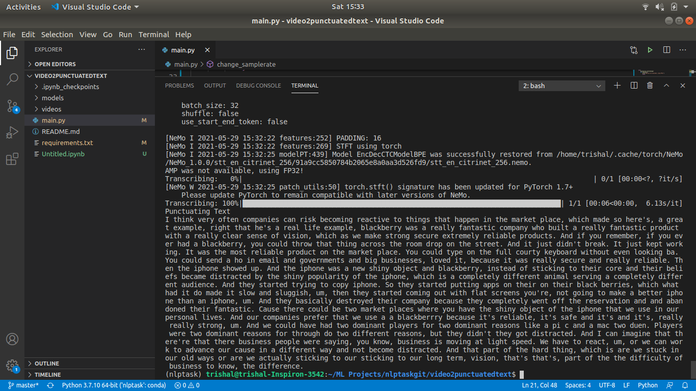

# video2punctuatedtext
It is used to trancribe vdeos to punctuated text.

# How to run:
# Step 1:
Create a virtual environment with python 3.7.10 installed. If using anaconda then use the below command: 

conda create --name env_name python=3.7.10 
Install the following packages: 
torch 
torchaudio 
omegaconf 
If using anaconda then the following commands should work: 
conda install pytorch torchvision torchaudio cpuonly -c pytorch 
conda install -c conda-forge omegaconf 

# Step 2:
Clone this repository

# Step 3:
Move inside the video2punctuatedtext folder

# Step 4:
Install the required libraries by using  the command: 

pip install -r requirements.txt 
You also need to install nemo_asr (https://docs.nvidia.com/deeplearning/nemo/user-guide/docs/en/main/asr/intro.html)

# Step 5:
Change the filepath in main.py to reflect your video path.

# Step 6:
Run the program using: 
python main.py

# Output:

#Resources Used

# Citrinet model by nvidia to convert speech to text
https://colab.research.google.com/gist/titu1994/a44fffd459236988ee52079ff8be1d2e/long-audio-transcription-citrinet.ipynb?pli=1
https://catalog.ngc.nvidia.com/orgs/nvidia/teams/tlt-jarvis/models/speechtotext_english_citrinet
# Punctuator to puctuate the text
https://pypi.org/project/punctuator/ 

https://github.com/ottokart/punctuator2
