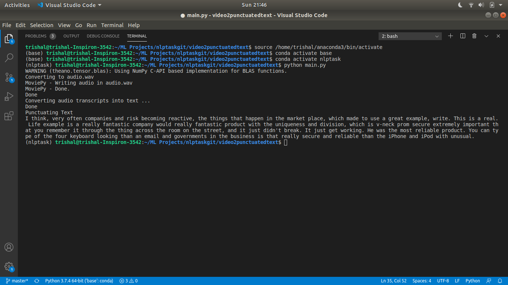

# video2punctuatedtext
It is used to trancribe vdeos to punctuated text.

# How to run:
# Step 1:
Create a virtual environment with python 3.7.10 installed. If using anaconda then use the below command: 

conda create --name env_name python=3.7.10
# Step 2:
Clone this repository

# Step 3:
Move inside the video2punctuatedtext folder

# Step 4:
Install the required libraries by using  the command: 

pip install -r requirements.txt

# Step 5:
Change the filepath in main.py to reflect your video path.

# Step 6:
Run the program using: 
python main.py

# Output:

